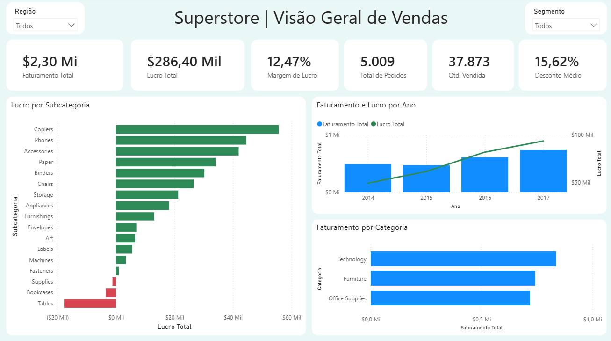
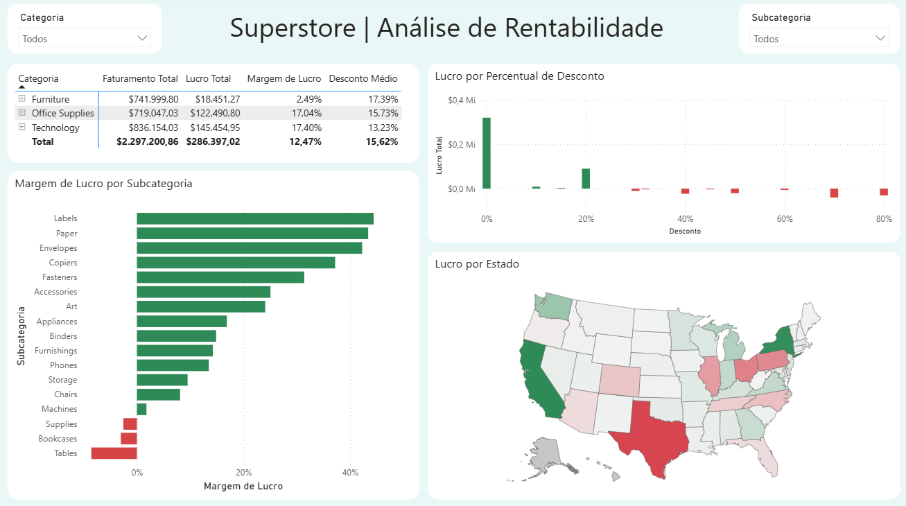

[Versão em português](README.md)

# Superstore Sales Analysis

Sales and profitability analysis project developed with SQL and Power BI using the Superstore dataset.

## Project Overview

This project analyzes the company’s sales performance based on revenue, profit, profit margin, discounts, product categories, yearly trends and geographic results.

The objective is to transform transactional data into useful information for identifying opportunities, low-profit products and factors that affect business profitability.

## Dashboard

### Sales Overview

### Profitability Analysis

## Key Performance Indicators

- Total revenue: $2.30 million
- Total profit: $286.40 thousand
- Profit margin: 12.47%
- Total orders: 5,009
- Units sold: 37,873
- Average discount: 15.62%

## Key Insights

- Technology generated the highest revenue and total profit.
- Furniture had a significantly lower profit margin than the other categories.
- Higher discount levels were associated with lower profits and frequent losses.
- Tables, Bookcases and Supplies showed negative profitability.
- California and New York were among the most profitable states, while Texas generated a significant loss.
- Revenue and profit increased throughout the analyzed period.

## Analyses Performed

- Revenue, profit and profit margin by category
- Profit and profit margin by subcategory
- Relationship between discounts and profit
- Yearly revenue and profit trends
- Profitability by state
- Performance comparison across regions and customer segments

## Tools Used

- SQL
- SQLite
- Power BI
- DAX
- Git and GitHub

## Repository Structure

- `database/` — SQLite database
- `sql/` — exploratory analysis queries
- `insights/` — documented business insights
- `Dashboard/` — Power BI report file
- `Dashboard/Screenshots_dashboards/` — dashboard screenshots

## Power BI Report

[Download the Power BI dashboard](Dashboard/superstore_dashboard.pbix)
